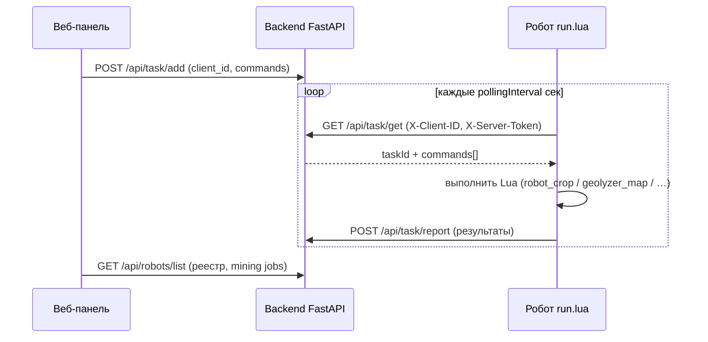

# Роботы OpenComputers: установка и подключение к GTNH Cyber

> **Аудитория:** оператор сервера / игрок, настраивающий OC-роботов в GT: New Horizons.  
> **Связанные файлы:** `oc-client/`, `kb/02-opencomputers/oc-client-install.md`, `kb/01-architecture/api-contract.md`.

---

## 1. Общая схема

OpenComputers **не принимает** входящие HTTP-запросы. Робот сам опрашивает бэкенд:



| Что | Где |
|-----|-----|
| Код клиента | репозиторий `remote-gtnh-control/oc-client/` |
| Реестр роботов, задания майнера | веб **Роботы** → API `/api/robots/*` |
| Очередь команд | **Задачи** или кнопки на странице **Роботы** → `/api/task/add` |
| Карта мира (сканер) | `geolyzer_map.push` → `POST /api/map/scan` |

---

## 2. Требования к любому роботу

### 2.1. Железо и компоненты OC

| Компонент | Зачем |
|-----------|--------|
| **Компьютер / микроконтроллер** в корпусе робота | Запуск `run.lua` |
| **Internet Card** (или эквивалент с `internet.request`) | Исходящий HTTP к бэкенду |
| **EEPROM** с автозапуском | Старт `run.lua` после перезагрузки |
| **Диск** (HDD/флоппи) | Хранение `oc-client/` |
| **Аккумулятор / генератор** | Энергия на движение и сеть |

Рекомендуется: **Inventory Upgrade** (слоты под урожай/блоки), при дальних поездках — **GPS Upgrade** (мировые координаты; без GPS навигация только относительными шагами).

### 2.2. Сеть и сервер

1. Бэкенд доступен **из игры** по URL (не `localhost` с ПК игрока, если Minecraft на другой машине).
2. В `.env` сервера задан `SERVER_TOKEN` — тот же секрет, что `serverToken` в `env.lua` робота.
3. В браузере (настройки SPA) указан тот же `X-Server-Token` для веб-UI.

Типичные порты (Docker, см. `README.ru.md`):

| Сервис | Порт на хосте |
|--------|----------------|
| Frontend | **8855** |
| Backend API | **8856** (внутри контейнера слушает **1030**) |

Пример `baseUrl` для робота в локальной сети: `http://192.168.1.10:8856`.

### 2.3. Куда копировать файлы на роботе

Одна **рабочая папка** на диске OC (например `/home/robot` или корень HDD). Структура **как в репозитории** `oc-client/`:

```text
/home/robot/                 ← рабочая директория (cd сюда перед запуском)
├── run.lua                  ← точка входа
├── env.lua                  ← URL, токен, clientId
├── lib/
│   ├── json.lua
│   ├── json2.lua
│   ├── base64.lua
│   └── logger.lua
├── src/
│   └── executor.lua
└── plugins/
    ├── robot_crop.lua       ← кроп-робот
    ├── robot_miner.lua      ← майнер-оператор
    ├── robot_power.lua      ← генератор / gas turbine + капсулы
    ├── geolyzer_map.lua     ← сканер / карта
    └── ae.lua               ← только если нужен AE2 на этом же клиенте
```

**Как перенести:** флешка OC, `wget` из интернета (если карта видит GitHub), копирование с ПК через сейв / FTP мира. Подробнее: `kb/02-opencomputers/oc-client-install.md`.

**Автозапуск:** в EEPROM прописать что-то вроде `lua /home/robot/run.lua` (путь = ваш).

**Проверка:** в shell робота `lua run.lua --debug` — в логе должны быть строки `Successfully loaded plugin: robot_crop` (и др.).

### 2.4. Настройка `env.lua` (обязательно)

Скопируйте `oc-client/env.lua` и измените:

```lua
local env = {
    pollingInterval = 8,                    -- интервал опроса /api/task/get (сек)

    baseUrl = "http://ВАШ_ХОСТ:8856",       -- без слэша в конце
    clientId = "robot_crop_01",             -- уникальный ID этого робота
    serverToken = "ВАШ_SERVER_TOKEN",     -- = SERVER_TOKEN на сервере

    getPath = "/api/task/get",
    reportPath = "/api/task/report",
    chunkedReportPath = "/api/task/chunked_report",

    -- только для сканера карты:
    mapScanPath = "/api/map/scan",

    -- aeAddress = "..."                   -- только для AE2-плагина
}
return env
```

| Поле | Правило |
|------|---------|
| `clientId` | **Уникален** для каждого робота; совпадает с реестром в веб-UI и заголовком `X-Client-ID`. |
| `serverToken` | Совпадает с `SERVER_TOKEN` бэкенда. |
| `mapScanPath` | Нужен роботу со сканером (`geolyzer_map.lua`). |

### 2.5. Регистрация в веб-панели

1. Откройте **http://&lt;хост&gt;:8855** → раздел **Роботы**.
2. Вкладка **Флот** → форма регистрации:
   - **Client ID** — ровно как `env.clientId` на роботе;
   - **Роль (kind)** — `crop` / `miner` / `scanner` / `generic`;
   - **Метка** — произвольное имя («Ферма север»).
3. Запустите на роботе `run.lua` — статус обновится после первых задач (через отчёты `/api/task/report`).

---

## 3. Робот для кропов (IC2 Crops)

**Плагин:** `plugins/robot_crop.lua`  
**Роль в UI:** `crop`  
**Документация GTNH:** `kb/03-gtnh/ic2-crops.md`

### 3.1. Назначение

Робот стоит **над грядкой / крестом IC2 Crops** и по команде с сервера:

- сканирует блок снизу (Geolyzer);
- «кликает» снизу (`robot.use`) — сбор зрелых культур;
- при необходимости ломает блок снизу (`robot.swing`) — осторожно, может вырвать крест.

Полный обход поля и селекция генов — **не автоматизированы** в текущей версии; выполняются отдельными задачами по одной клетке или вручную.

### 3.2. Что нужно роботу в игре

| Предмет / апгрейд | Обязательность |
|-------------------|----------------|
| Корпус **Robot** (не дрона без нужных апгрейдов) | Да |
| **Internet Card** | Да |
| **Geolyzer** upgrade | Рекомендуется (`scanBelow`, `hardnessPatch`) |
| Слоты инвентаря (upgrade) | Рекомендуется — хранить урожай |
| Зарядка (charger) рядом с полем | Рекомендуется |
| IC2 **Crop Sticks** + посаженные культуры под роботом | Да (смысл фермы) |
| **Crop Manipulator** (peripheral) | Опционально (точный `getCrop` / `harvestCrop` — в плагине пока не используется) |

Робот должен **стоять так**, чтобы сторона `sides.down` указывала на крест/грядку.

### 3.3. Алгоритм работы

```text
[Старт] run.lua → загрузка robot_crop.lua → цикл pollingInterval

1. GET /api/task/get?client_id=robot_crop_01
2. Если есть taskId и commands:
     для каждой команды (строка Lua):
       выполнить, например: return robot_crop.harvestBelow()
     POST /api/task/report с { message, data }
3. sleep → повтор

Функции плагина (возвращают { message = "success", data = ... }):
  robot_crop.scanBelow()     — geolyzer.analyze(sides.down)
  robot_crop.harvestBelow()  — robot.use(sides.down)
  robot_crop.swingBelow()    — robot.swing(sides.down)
  robot_crop.hardnessPatch() — geolyzer.scan(0,0) превью
```

### 3.4. Подключение к бэкенду (пошагово)

1. Скопировать на диск робота файлы из §2.3 + **`plugins/robot_crop.lua`**.
2. В `env.lua`: уникальный `clientId`, например `robot_crop_01`.
3. Зарегистрировать робота в веб-UI (kind = **crop**).
4. Поставить робота над культурой, запустить `lua run.lua`.
5. В веб-UI **Роботы** → кнопка **Сбор снизу** (ставит задачу)  
   **или** вручную:

```bash
curl -sS -X POST "http://ХОСТ:8856/api/task/add" \
  -H "Content-Type: application/json" \
  -H "X-Server-Token: ВАШ_TOKEN" \
  -d '{
    "client_id": "robot_crop_01",
    "commands": ["return robot_crop.harvestBelow()"]
  }'
```

6. В логе робота (`--debug`) — выполнение команды; в ответе report — `data.used` и сторона `down`.

**Типовой цикл фермы (оператор):** серия задач `harvestBelow` / перемещение робота новыми задачами с `robot.forward()` и т.д. (команды движения — обычный Lua в `commands`).

---

## 4. Робот-сканер (карта мира / Geolyzer)

**Плагин:** `plugins/geolyzer_map.lua`  
**Роль в UI:** `scanner`  
**API карты:** `POST /api/map/scan` → таблица `world_blocks` → страница **Карта** в веб-UI.

Отдельного файла `robot_scanner.lua` нет: сканер — это тот же OC-клиент с плагином **geolyzer_map**.

### 4.1. Назначение

Собрать наблюдения о блоках (имя, hardness, координаты, измерение) и отправить пакетом на сервер для отображения на 2D-карте (смещение центра карты задаётся в фронтенде).

### 4.2. Что нужно роботу в игре

| Предмет / апгрейд | Обязательность |
|-------------------|----------------|
| Robot + **Internet Card** | Да |
| **Geolyzer** upgrade (или блок geolyzer рядом — для мобильного робота только upgrade) | Да |
| **GPS Upgrade** | Сильно рекомендуется — без него координаты в задачу нужно вводить вручную с F3 |
| Энергия / charger | Да |
| (Опционально) Chunk Loader в зоне сканирования | Чтобы чанки не выгружались |

### 4.3. Алгоритм работы

```text
[Старт] run.lua → geolyzer_map.lua

Вариант A — одна точка (из задачи на сервере):
  1. Оператор смотрит F3: x, y, z, dimension
  2. Задача на робота:
       local s = require("sides")
       local r = geolyzer_map.analyzeAt(0, X, Y, Z, s.down)
       if r.message ~= "success" then return r end
       return geolyzer_map.push({ r.data })

Вариант B — пакет точек (патруль вручную составлен на сервере):
  return geolyzer_map.push({
    { dimension=0, x=100, y=70, z=200, block_name="minecraft:stone", hardness=1.5 },
    { dimension=0, x=101, y=70, z=200, block_name="gregtech:gt.blockores", hardness=3.0 },
  })

[На сервере]
  POST /api/map/scan { observations: [...] }  → upsert world_blocks

[В браузере]
  Карта → выбор измерения → точки на Leaflet
```

**Внутри `geolyzer_map.push`:** HTTP POST на `env.baseUrl .. env.mapScanPath` с заголовками `X-Server-Token`, `X-Client-ID`.

**Поля наблюдения:**

| Поле | Описание |
|------|----------|
| `dimension` | 0 = Overworld, и т.д. |
| `x`, `y`, `z` | Мировые координаты **блока** |
| `block_name` | Например `gregtech:gt.blockores` (из `geolyzer.analyze`) |
| `hardness` | Число |
| `fluid` | Опционально |
| `meta` | Опционально, таблица |

### 4.4. Подключение к бэкенду (пошагово)

1. Скопировать `oc-client/` + **`plugins/geolyzer_map.lua`**.
2. В `env.lua` добавить `mapScanPath = "/api/map/scan"`, `clientId = "robot_scanner_01"`.
3. Зарегистрировать в UI (kind = **scanner**).
4. Запустить `run.lua`.
5. Пример задачи (подставьте координаты с F3):

```bash
curl -sS -X POST "http://ХОСТ:8856/api/task/add" \
  -H "Content-Type: application/json" \
  -H "X-Server-Token: ВАШ_TOKEN" \
  -d '{
    "client_id": "robot_scanner_01",
    "commands": [
      "local s=require(\"sides\"); local r=geolyzer_map.analyzeAt(0,100,70,200,s.down); if r.message~=\"success\" then return r end; return geolyzer_map.push({r.data})"
    ]
  }'
```

6. Откройте **Карта** в веб-UI — должна появиться точка (после refresh).

**Патруль сеткой:** в текущей сборке нет готового `scanArea()` — либо несколько задач с разными координатами, либо расширение плагина (см. `kb/02-opencomputers/component-geolyzer.md`).

---

## 5. Робот-оператор майнера (GregTech Miner)

**Плагин:** `plugins/robot_miner.lua`  
**Роль в UI:** `miner`  
**Очередь точек:** `/api/robots/mining-jobs` + вкладка **Задания майнера**  
**Документация GTNH:** `kb/03-gtnh/gt-miner.md`

### 5.1. Назначение

MVP: робот получает **координаты** размещения GregTech Miner с веб-UI, подтверждает задание, отчитывается ping/place. **Автонавигация до точки и полный цикл «поставил → ждал → выгрузил» в Lua не реализованы** — см. ответ `acceptJob` (`Navigation/placement not automated`).

Оператор вручную ведёт робота к точке или дописывает свои Lua-команды движения в задачах.

### 5.2. Что нужно роботу в игне

| Предмет | Зачем |
|---------|--------|
| Robot + Internet + инвентарь | База |
| В инвентаре: **GregTech Miner** (Basic / Advanced / Advanced II) | `robot_miner.placeForward()` — установка вперёд |
| Кабель EU, апгрейды майнера по гайду GTNH | Питание машины после установки |
| Сундук / ME interface рядом с точкой | Выгрузка руды (вручную или будущая автоматизация) |
| GPS (желательно) | Сверка координат с заданием с сервера |

### 5.3. Алгоритм работы (целевой и текущий)

**На бэкенде (всегда):**

```text
1. Оператор: Роботы → Задания майнера → создать job
   (robot_client_id, x, y, z, dimension, miner_kind, note)
   state = pending

2. (Опционально) PATCH job → running / done через UI

3. GET /api/robots/mining-jobs/next?robot_client_id=robot_miner_01
   → следующая pending-точка для скрипта робота
```

**На роботе (сейчас):**

```text
ping:
  return robot_miner.ping()
  → { energy, select_ok } — проверка связи

acceptJob (координаты с сервера в команде):
  return robot_miner.acceptJob({ job_id=1, x=100, y=64, z=-200, dim=0, miner_kind="advanced_miner" })
  → phase=accepted, target=..., note=навигация не автоматизирована

placeForward:
  выбрать слот с майнером → robot.place(sides.front)
```

**Целевой state machine (бэкенд + будущий Lua):**  
`idle → moving → placing → mining → unloading → returning → idle` — см. `kb/03-gtnh/gt-miner.md`.

### 5.4. Подключение к бэкенду (пошагово)

1. Файлы `oc-client/` + **`plugins/robot_miner.lua`**.
2. `env.lua`: `clientId = "robot_miner_01"`.
3. UI: регистрация kind = **miner**.
4. UI: **Задания майнера** — указать тот же `robot_client_id`, координаты, `miner_kind` (например `advanced_miner`). При создании задание **автоматически** попадает в очередь OC (`acceptJob`), статус → `running`.
5. Запустить `run.lua` (`cd /home/gtnh && lua run.lua`).
6. Проверка связи — кнопка **Ping** на странице **Роботы** или:

```bash
curl -sS -X POST "http://ХОСТ:8856/api/task/add" \
  -H "Content-Type: application/json" \
  -H "X-Server-Token: ВАШ_TOKEN" \
  -d '{"client_id":"robot_miner_01","commands":["return robot_miner.ping()"]}'
```

7. Принять задание (подставьте id и координаты из UI):

```bash
curl -sS -X POST "http://ХОСТ:8856/api/task/add" \
  -H "Content-Type: application/json" \
  -H "X-Server-Token: ВАШ_TOKEN" \
  -d '{
    "client_id": "robot_miner_01",
    "commands": [
      "return robot_miner.acceptJob({ job_id=1, x=100, y=64, z=-200, dim=0, miner_kind=\"advanced_miner\" })"
    ]
  }'
```

8. Довести робота до точки **вручную**, выбрать слот с майнером, выполнить задачу `return robot_miner.placeForward()`.

---

## 6. Робот-оператор генератора (Combustion / Gas Turbine)

**Плагин:** `plugins/robot_power.lua`  
**Роль в UI:** `power`  
**Очередь:** `/api/robots/power-jobs` + вкладка **Генераторы / турбины**  
**Документация:** `kb/03-gtnh/gt-power-deploy.md`

### 6.1. Назначение

Робот ставит **одноблочный генератор** (Combustion, Advanced Combustion) или **Gas Turbine** и заливает **топливо из капсул** в инвентаре (diesel, gas, …). Навигация — вручную, как у майнера.

### 6.2. Инвентарь

| Слот | Содержимое |
|------|------------|
| 1 | Блок генератора / турбины |
| 2–6 | Капсулы с топливом (`fuel_kind` в задании) |

### 6.3. Команды

```bash
# Ping
curl -X POST "http://ХОСТ:18856/api/task/add" \
  -H "Content-Type: application/json" -H "X-Server-Token: TOKEN" \
  -d '{"client_id":"robot_miner_01","commands":["return robot_power.ping()"]}'

# Полный deploy (после ручного подъезда к точке)
curl -X POST "http://ХОСТ:18856/api/task/add" \
  -H "Content-Type: application/json" -H "X-Server-Token: TOKEN" \
  -d '{"client_id":"robot_miner_01","commands":["return robot_power.deploy({ job_id=1, x=100, y=70, z=200, dim=0, generator_kind=\"advanced_combustion_generator\", fuel_kind=\"diesel\", capsule_count=4, generator_slot=1, fuel_slots={2,3,4,5,6} })"]}'
```

В UI: **Роботы → Генераторы / турбины** → создать задание → **В очередь deploy**.

---

## 7. Сводная таблица

| Робот | Плагин | clientId пример | Kind в UI | Ключевые апгрейды | API кроме `/api/task/*` |
|-------|--------|-----------------|-----------|-------------------|-------------------------|
| Кропы | `robot_crop.lua` | `robot_crop_01` | crop | Geolyzer, инвентарь | — |
| Сканер | `geolyzer_map.lua` | `robot_scanner_01` | scanner | Geolyzer, GPS | `POST /api/map/scan` |
| Майнер | `robot_miner.lua` | `robot_miner_01` | miner | GPS, слот под майнер | `/api/robots/mining-jobs*` |
| Энергия | `robot_power.lua` | `robot_miner_01` | power | GPS, генератор + капсулы | `/api/robots/power-jobs*` |

---

## 8. Устранение неполадок

| Симптом | Проверка |
|---------|----------|
| `Unauthorized` / 403 | `serverToken` = `SERVER_TOKEN`, токен в браузере |
| Робот не получает задачи | `client_id` в задаче = `env.clientId`; `run.lua` запущен |
| `Error loading plugin` | Путь `plugins/*.lua`, наличие `lib/json.lua` |
| `no geolyzer` | Установлен Geolyzer upgrade |
| `map push failed` | `mapScanPath`, доступность `baseUrl` из игры |
| Плагин не найден в команде | Сначала загрузить `run.lua` (он делает `require("plugins/...")`) |
| Карта пустая | Был ли успешный `geolyzer_map.push`; измерение в UI карты |

Логи: `lua run.lua --debug`. Контракт API: `kb/01-architecture/api-contract.md`.

---

## 9. См. также

- `kb/02-opencomputers/oc-client-install.md` — wget, список файлов  
- `kb/02-opencomputers/component-robot.md` — API `robot.*`  
- `kb/02-opencomputers/component-geolyzer.md` — сканирование  
- `kb/01-architecture/decisions/002-robots-phase4.md` — ADR по модулю роботов  
- `kb/01-architecture/decisions/004-map-phase5.md` — ADR по карте  
- `website/src/pages/Robots.vue` — кнопки «Сбор» / «Ping»
